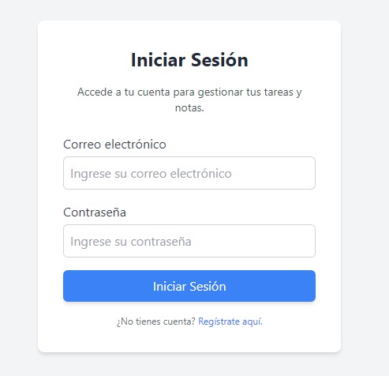
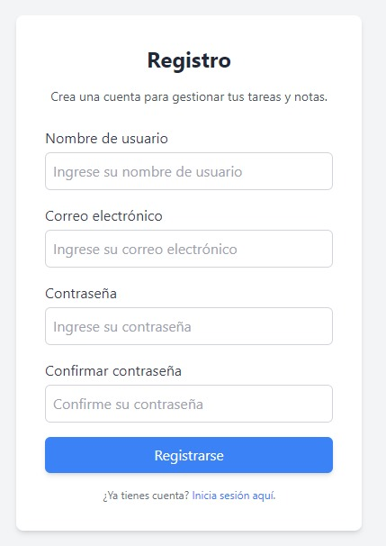
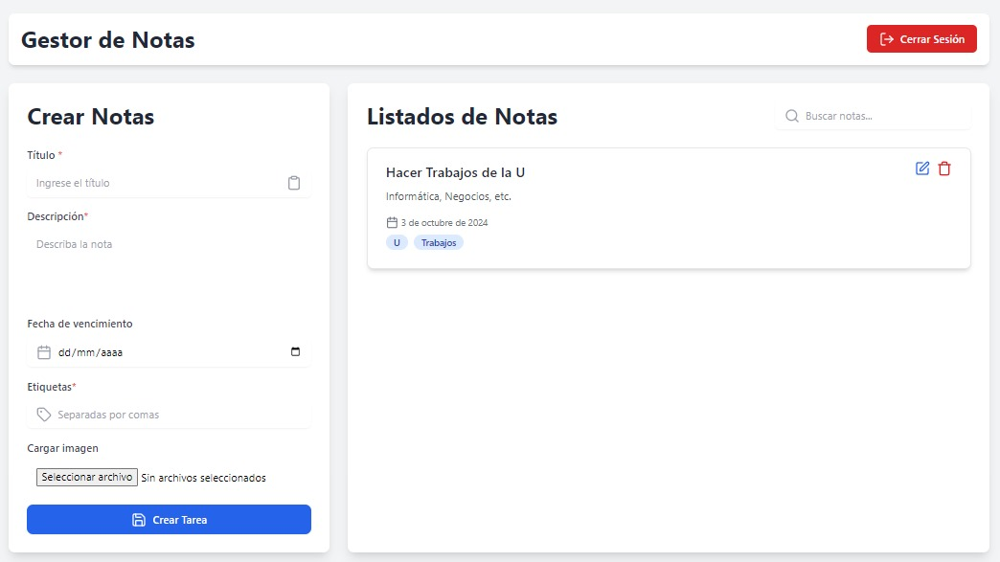

# Proyecto To-Do con Laravel y Vue.js
Este proyecto es una aplicación web de tareas ("To-Do") que utiliza Laravel para el backend y Vue.js para el frontend.

## Requisitos

Asegúrate de que tu entorno cumpla con los siguientes requisitos:

+ PHP >= 8.1
+ Composer
+ Node.js >= 16.x
+ NPM >= 8.x
+ MySQL o cualquier base de datos compatible con Laravel
+ Laravel >= 9.x
+ Vue.js >= 2.7x

## Instalación

1. Clona el repositorio.

~~~
https://github.com/Carlos-Leguizamo/todo-app.git
~~~

2. Configura el entorno.

Copia el archivo .env.example y renómbralo a .env:

Edita el archivo .env para configurar tu base de datos, correo y otros detalles. Asegúrate de ajustar los siguientes campos:

~~~php
DB_CONNECTION=mysql
DB_HOST=127.0.0.1
DB_PORT=3306
DB_DATABASE=nombre_de_tu_bd
DB_USERNAME=tu_usuario
DB_PASSWORD=tu_contraseña
~~~

3. Instala dependencias de PHP.
   
Utiliza Composer para instalar las dependencias de Laravel:
~~~
composer install
~~~

4. Genera la clave de la aplicación.
   
Ejecuta el siguiente comando para generar la clave de la aplicación de Laravel:
~~~
php artisan key:generate
~~~

5. Configuración de la base de datos.

Crea una base de datos en tu servidor MySQL con el nombre que hayas especificado en el archivo .env.

Luego, ejecuta las migraciones para crear las tablas necesarias

~~~
php artisan migrate
~~~

6. Instala dependencias de Node.js.
   
Utiliza npm para instalar las dependencias del frontend:
~~~
npm install
~~~

7. Compila los assets del frontend.
   
Compila los archivos de Vue.js para desarrollo o producción:

Para desarrollo:

~~~
npm run dev
~~~

8. Inicia el servidor de desarrollo.
   
Inicia el servidor de Laravel utilizando el siguiente comando
~~~
php artisan server
~~~

9. Inicia el servidor de frontend (opcional). 
    
Si quieres que Vue.js corra en un servidor independiente, puedes ejecutar el siguiente comando:

~~~
npm run server
~~~

## :earth_africa: Lenguajes:

## :computer: Framework:

## :gear: Herramientas:

## Iniciar Sesión

## Registro

## Panel principal

